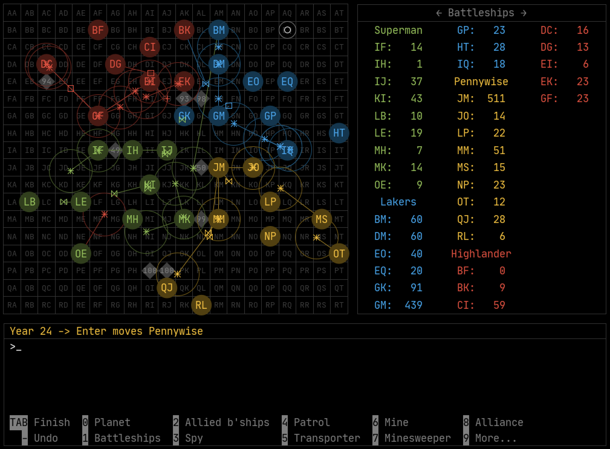

# VEGA

A strategy game since 1989.

## Author

Michael Schweitzer

## What is VEGA?



VEGA is a turn-based strategy game for 2 to 6 people in an 80s retro design. Whoever conquers the most planets with their spaceships wins the game. Play individually or in teams. Strategic thinking, diplomatic skills and a little luck are required. That's why VEGA is most fun in a friendly group of at least four players. There are no computer opponents, nor are there any graphic or sound effects.

There are various types of spaceships with special abilities at your disposal. You can improve your planets to increase production capacity and combat strength.

You can play VEGA in different ways:

* In the classic "Hot Seat" mode, players sit at a computer and enter their moves one by one. Take an afternoon and evening, sit on a big couch in front of a big screen or projector, line out chips and unhealthy drinks, turn off any gadgets that didn't exist in the '80s and have a good time together.

* As an e-mail game. The players enter their moves on their own computers and send them by e-mail to the game master, who in turn distributes the evaluation to the players by e-mail.

* As a server game: Set up your own VEGA server to host the games with little effort. The players enter their moves on their own computers and send them to the server, which carries out the evaluations. You can use it to host a social LAN party or allow players from all over the world to join a VEGA game.

VEGA offers you a tutorial for a quick introduction to the game.

## Documentation

Manual: [German](resources/VegaHelp_de-DE.pdf), [English](resources/VegaHelp_en-US.pdf) 

## Download and Execute

[https://github.com/spielwitz/vega/releases](https://github.com/spielwitz/vega/releases)

Copy the contents of the zip file into a local folder of your choice. The following jar files are executables and can usually be started by double-clicking on them:

* Vega.jar

* VegaDisplay.jar

If double-clicking should not work, open a command prompt, go to your local folder and execute the apps as follows:

```
java -jar Vega.jar
java -jar VegaDisplay.jar
```

The VEGA server can only be started from the command prompt:

```
java -jar VegaServer.jar
```

## Built With

Eclipse, Java 8

## License

This project is licensed under the [GNU Affero General Public License](https://www.gnu.org/licenses/agpl-3.0.en.html)

## Acknowledgments

* [GSON](https://github.com/google/gson) (c) Google. See also file [src/ApacheLicense-2.0.txt](src/ApacheLicense-2.0.txt)
* [iText PDF](https://itextpdf.com/en) (c) ITEXT GROUP NV. [GNU Affero General Public License](https://www.gnu.org/licenses/agpl-3.0.en.html)
* [JetBrains Mono](https://www.jetbrains.com) (c) JetBrains. See also file [src/ApacheLicense-2.0.txt](src/ApacheLicense-2.0.txt)
* [Default Icons](http://www.defaulticon.com). See also file [src/DefaultIconLicense.txt](DefaultIconLicense.txt)
* [FlatLaf](https://www.formdev.com/flatlaf/) (c) FormDev Software GmbH. See also file [src/ApacheLicense-2.0.txt](src/ApacheLicense-2.0.txt)
* [QR Code generator library (Java)](https://www.nayuki.io/page/qr-code-generator-library) (c) Project Nayuki. [MIT license](https://opensource.org/licenses/MIT) 
