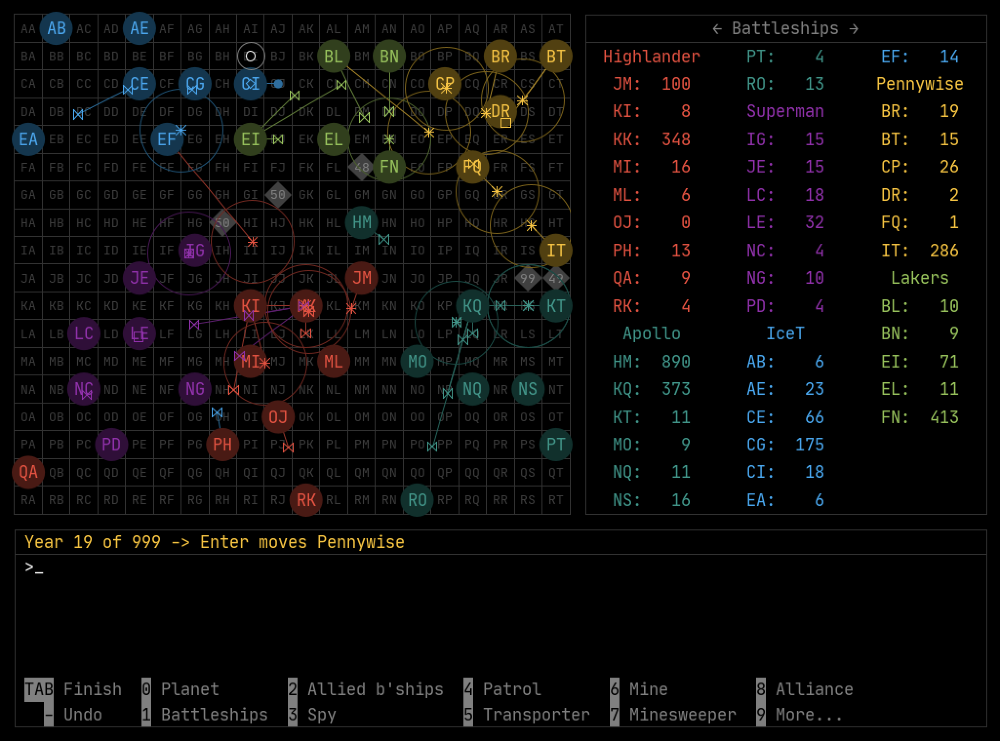

# VEGA

A strategy game since 1989.

## Author

Michael Schweitzer

## Download

[https://github.com/spielwitz/vega/releases](https://github.com/spielwitz/vega/releases)

Extract Vega.jar, VegaDisplay.jar, and VegaServer.jar from the zip file and copy them to a local folder of your choice.

## What is VEGA?

VEGA is a turn-based strategy game for two to six players with a retro 80s look. After all, the game has been around since 1989. Conquer as many planets as possible with your spaceships. Fight alone or form alliances with your fellow players and go on a conquest tour together. You need strategic and diplomatic skills and a bit of luck to assert yourself in space. You have different types of spaceships with special abilities at your disposal. You can expand your planets to increase their production capacity and defense strength. The players who own the most planets at the end of the agreed playing time win.

You can play VEGA in different ways:

* In the classic "Hot Seat" mode, players sit at a computer and enter their moves one by one. Take an afternoon and evening, sit on a big couch in front of a big screen or projector, line out chips and unhealthy drinks, turn off any gadgets that didn't exist in the '80s and have a good time together.

* As an e-mail game. The players enter their moves on their own computers and send them by e-mail to the game master, who in turn distributes the evaluation to the players by e-mail.

* As a server game: Set up your own VEGA server to host the games with little effort. The players enter their moves on their own computers and send them to the server, which carries out the evaluations. You can use it to host a social LAN party or allow players from all over the world to join a VEGA game.

VEGA offers you a tutorial for a quick introduction to the game.

## Documentation

Manual: [German](resources/VegaHelp_de-DE.pdf), [English](resources/VegaHelp_en-US.pdf) 

## Built With

Eclipse, Java 1.8

## License

This project is licensed under the [GNU Affero General Public License](https://www.gnu.org/licenses/agpl-3.0.en.html)

## Acknowledgments

* [GSON](https://github.com/google/gson) (c) Google. See also file [src/ApacheLicense-2.0.txt](src/ApacheLicense-2.0.txt)
* [iText PDF](https://itextpdf.com/en) (c) ITEXT GROUP NV. [GNU Affero General Public License](https://www.gnu.org/licenses/agpl-3.0.en.html)
* [JetBrains Mono](https://www.jetbrains.com) (c) JetBrains. See also file [src/ApacheLicense-2.0.txt](src/ApacheLicense-2.0.txt)
* [Default Icons](http://www.defaulticon.com). See also file [src/DefaultIconLicense.txt](DefaultIconLicense.txt)
* [FlatLaf](https://www.formdev.com/flatlaf/) (c) FormDev Software GmbH. See also file [src/ApacheLicense-2.0.txt](src/ApacheLicense-2.0.txt)
* [QR Code generator library (Java)](https://www.nayuki.io/page/qr-code-generator-library) (c) Project Nayuki. [MIT license](https://opensource.org/licenses/MIT) 
